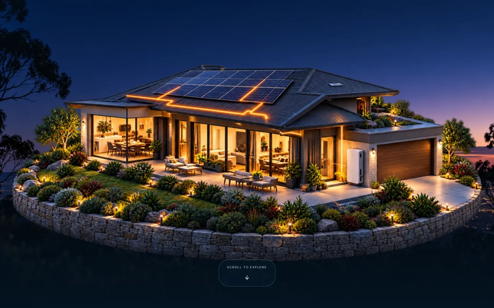
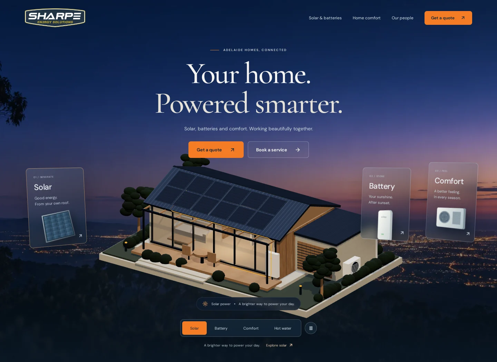

# Sharpe En3rgy Solutions — connected home concept

An independent, responsive website concept created by Lucas De Rossa. A photorealistic layered house with subtle floating motion and pointer parallax is the centre of an interactive solar / battery / comfort / hot water showroom. The home and twilight photography are illustrative. The original logo is supplied by the project owner; the technician photo is sourced from the company website.





## Development

Node.js 22 or newer is recommended.

```sh
npm ci
npm run dev
npm run build
npm run preview
```

## Cloudflare Pages

Connect this repository to **Workers & Pages → Create → Pages → Connect to Git**.

- Production branch: `main`
- Framework preset: `Vite` (or `None` with the same settings)
- Build command: `npm run build`
- Build output directory: `dist`
- Root directory: leave blank
- Node version: set `NODE_VERSION` to `22` if needed

Choose your project name before deploying; it determines the initial `pages.dev` address. No Workers runtime, database, API keys or server configuration is needed. Deployment is performed manually by the repository owner.

## Interaction and accessibility

The first viewport shows only the complete house and an accessible “Scroll to explore” cue. Normal page scrolling progressively reveals the header, title and glass cards while the hero remains pinned for a short introduction. Clicking the cue or activating it with the keyboard also reveals the page. Scrolling back to the top restores the house-only view.

Four service tabs and clickable foreground cards select solar, battery, comfort and hot water explanations. Their consistent accent colours are amber, mint, blue and lilac respectively. Hidden controls are inert, and the small cards sit above the larger cards rather than inside the moving image layer. On mobile, the four small controls form a readable row below the house. The house is a transparent raster image with 2.5D motion, not a rotatable 360-degree model. Animation pauses off-screen; a pause control and reduced-motion preference are supported. All controls and content are accessible HTML. No WebGL is required. Touch keeps normal vertical scrolling. The entrance uses opacity, not blur. Sections have clean boundaries, with no blurred transition bands. Keyboard tabs support Left/Right, Home and End.

A local quote helper selects a service and suburb. It does not transmit or persist personal data; it directs visitors to the official quote system. No testimonials, savings figures or customer installation claims are invented.

## Official destinations

Quote: https://new.easybook.au/#easy-quote
Service booking: https://new.easybook.au/#service
Telephone: +61 8 8294 6333
Company site: https://en3rgy.au/

Search indexing is disabled for this speculative concept. Remove both the robots meta tag and `X-Robots-Tag` header only when approved for a real production site.
